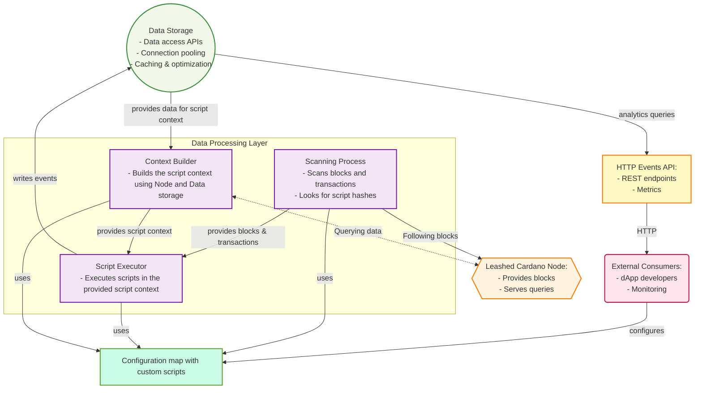
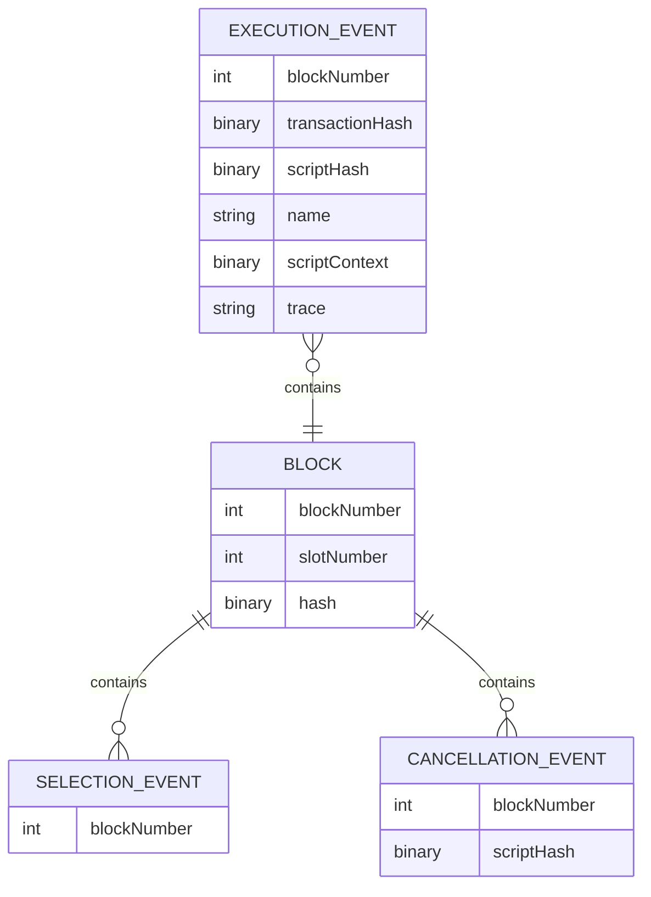

## Abstract

This document proposes an architecture for "Plutus Script Re-Executor" — a tool for Cardano dapps developers to run custom PlutusCore scripts while following the node in parallel to the original scripts.

This is up-to-date document. The history of decisions that influenced the specification should be available in [ADRs](adr/)

### Architecture Overview

The Plutus Script Re-Executor system consists of main components:

1. **Scanning Process** — process that connects to Cardano node and follows it, scanning the blocks
2. **Context builder** — instrument that provides `ScriptContext` for a given `ScriptHash` 
3. **Script executor** — tool to run custom `PlutusCore` scripts using the provided `ScriptContext` 
4. **Events API** — REST endpoints with access to the results of the re-executor
5. **Full Cardano Node** — standard node providing blocks, validation services and canonical chain state
6. **Leash Node-to-Client protocol** — mini-protocol & connection mode to limit the node's eagerness
7. **Configuration map** — user configuration parser
8. **Data storage** — database to keep the data



### Glossary

- ScriptHash — Type representing the /BLAKE2b-224/ hash of a script. 28 bytes.
- ScriptContext — An input to a Plutus script created by the ledger. It includes details of the transaction being validated. Additionally, since a transaction may do multiple things, each of which needs to be validated by a separate script, the script context also specifies what exactly the current script is responsible for validating. 
- PlutusCore — a low-level language for on-chain code, based on untyped lambda calculus.
- Mini-protocol — a mini protocol is a well-defined and modular building block of the network protocol. Structuring a protocol around mini-protocols helps manage the overall complexity of the design and adds useful flexibility.

References:
- https://plutus.cardano.intersectmbo.org/docs/glossary
- https://ouroboros-network.cardano.intersectmbo.org/pdfs/network-spec/network-spec.pdf


### Component Specifications

#### 1. Scanning process

**Purpose**: follows the node and scans for specified `ScriptHash` scripts. 

**Configuration**: takes a list of `ScriptHash` entities from the configuration map.

#### 2. Context builder

**Purpose**: to be able to run a script we need to rebuild its context on-chain, this component either provides it from the data storage or queries from the node. 

#### 3. Script executor

**Purpose**: run the provided `PlutusCore` script in the given `ScriptContext`.

**Configuration**: takes the configuration map.

**Details**: the executor takes the configuration map and each time it sees a known `ScriptHash` in the transaction, it executed the corresponding script from the map. 

#### 4. Events API

**Purpose**: provides access to the results of the scripts re-executing. 

**Architecture**: HTTP API that queries data, providing JSON responses.

**Types of events**:

- **Execution**: identifies each re-execution and includes its observed trace messages.
- **Selection**: identifies when each time the local node updates its selection, including the slot number, block number, and header hash, which is sufficient information for the dapp developer to estimate of the on-going settlement probability for each script execution, according to standard Cardano settlement tables.
- **Cancellation**: identifies which script executions were undone whenever the local node switches away from the blocks that executed some scripts in the configuration data.

**Endpoints**:

##### GET /events/

Returns all events with filtering.

**Query Parameters**:
- `type`: `execution`, `selection`, or `cancellation` (required)
- `time_range`: ISO 8601 time range (optional)
- `slot_range`: Slot number range (optional)
- `limit`: Results per page (default: 50, max: 1000)
- `offset`: Pagination offset (default: 0)

**Response**: JSON array of all relevant events with basic metadata (block hash, slot, timestamp).

##### GET /events/{ script_hash | name or alias }

Returns all events relevant to the provided `script_hash` or `name` with filtering.

**Query Parameters**:
- `type`: `execution`, `selection`, or `cancellation` (required)
- `time_range`: ISO 8601 time range (optional)
- `slot_range`: Slot number range (optional)
- `limit`: Results per page (default: 50, max: 1000)
- `offset`: Pagination offset (default: 0)

**Response**: JSON array of all relevant events to the provided `script_hash` with basic metadata (block hash, slot, timestamp).

##### GET /metrics

Prometheus metrics endpoint exposing operational statistics in standard exposition format.

**Key Metrics**:
- Scanning: blocks/transactions scanned, scripts per block/transaction
- Processing: operation durations, unprocessed data backlog, database operations
    - Average block processing time
    - Average script execution time
- Storage: database size by table, evictions, storage limit hits
- System Health: active processes, service availability, resources consumption

#### 5. Full Cardano Node Integration

**Purpose**: Provide data for the scanning process. 

**Responsibilities**:

- **Validation Service**: Provides Node-to-Client queries for background workers to classify collected data
- **Canonical Chain State**: Maintains full ledger state to identify which blocks are on the canonical chain

**Configuration**:

- Standard cardano-node with normal network connectivity
- Maintains full ledger state for validation queries

#### 6. Leash Node-to-Client protocol

**Purpose**: a Node-to-Client protocol that allows to "leash" the node and keep the resource usage under control.

**Details**: TODO: describe the Leash protocol.

#### 7. Configuration map

**Purpose**: allows to user to specify which scripts should be executed under specified `script_hash`. 

**Format**:

Each script is specified by:
- Script hash
- Name/alias (optional)
- Either CborHex or file path or plain text uplc

**Example**:

```yaml
scripts:
  - script_hash: 921169a988ba72ffd6e9c269cadb3b53b5f360ff99f112d9b2ee30c4d74ad88b
    cbor_hex: 73475cb40a568e8da8a045ced110137e159f890ac4da883b6b17dc651b3a804973475cb40a568e8da8a045ced110137e159f890ac4da883b6b17dc651b3a804973475cb40a568e8da8a045ced110137e159f890ac4da883b6b17dc651b3a804973475cb40a568e8da8a045ced110137e159f890ac4da883b6b17dc651b3a8049

  - script_hash: 622229a988ba72ffd6e9c269cadb3b53b5f360ff99f112d9b2ee30c4d74ad88b
    name: my_script
    path: my_custom_script.json

  - script_hash: 777729a988ba72ffd6e9c269cadb3b53b5f360ff99f112d9b2ee30c4d74ad88b
    plain_uplc: |
       (program 0.1.0 (con integer 42)) 

```

where `my_custom_script.json`:

```json
{
    "type": "PlutusScriptV1",
    "description": "",
    "cborHex": "585e585c01000033322232323233223232322223335300c333500b00a0033004120012009235007009008230024830af38f1ab664908dd3800891a8021a9801000a4c24002400224c44666ae54cdd70010008030028900089100109100090009"
}
```

#### 8. Data storage

**Purpuse**: to save the emitted events for Events API and future analysis. 

**Motivation**: the current ledger state is big and we can't rely on RAM only to store the execution results. If a user specifies a popular script that is executed very often we easily can get a memory overflow error. 

**Entities**:

Block:
- `block_number`: Block number
- `hash`: Header hash 
- `slot`: Slot number 

Execution event:
- `block_number`: Block number 
- `transaction_hash`: Transaction hash 
- `script_hash`: `ScriptHash`
- `name`: Name or alias (optional)
- `script_context`: Relevant to the execution `ScriptContext`
- `trace`: Trace of the execution 

Cancellation event:
- `block_number`: Block number 
- `script_hash`: Script hash that was cancelled

Selection event:
- `block_number`: Block number 


